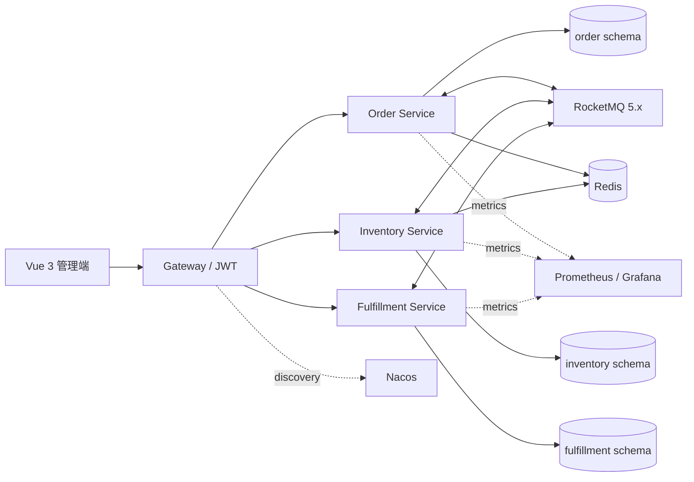

# AutoFlow 汽车销售订单履约平台

AutoFlow 是一个基于真实汽车销售业务经验重新抽象的个人项目，用于演示多渠道订单从创建、审核、库存配额锁定、支付、VIN 分配到车辆交付的完整链路。

> 项目不包含任何企业内部代码、数据或字段，也不代表任何企业的生产系统实现。

## 核心能力

- 四个可独立部署的 Spring Cloud 服务，使用 Nacos 完成注册发现与配置接入；
- 门店、官网、小程序订单统一进入订单中心，保留渠道单号和客户快照；
- 车型配额预占与具体 VIN 分配分为两个阶段；
- Redisson 按“门店 + 车型”减少热点竞争，MySQL 条件更新和唯一约束保证不超卖；
- Transactional Outbox + RocketMQ 5.x 实现跨服务最终一致性；
- `eventId` 幂等表、Broker 重试和死信机制防止重复扣减、退款或交付；
- Redis cache-aside 缓存订单详情，数据库始终是库存事实源；
- Spring Security JWT + RBAC，销售人员只能访问本门店数据；
- 支付模拟器支持成功、失败和超时；
- 可扩展订单记录承载客户、收付款、退款、保险等子页面字段并保留来源和操作审计；
- 管理员事件中心支持死信查询、人工重放和重放人审计；
- Actuator、Prometheus、Grafana 提供业务指标、自动仪表盘和告警规则；
- Vue 3 + TypeScript + Element Plus 管理端。

## 架构



详细设计见 [docs/ARCHITECTURE.md](docs/ARCHITECTURE.md)。

## 环境要求

- Java 17；
- Docker Desktop（Linux 容器模式）与 Docker Compose；
- Node.js 24（仅本地开发前端时需要）；
- Windows PowerShell 7/5.1；Linux/macOS 可直接使用等价的 Maven、npm 和 Compose 命令。

不要求全局安装 Maven，仓库内的 `mvnw.cmd` / `mvnw` 会下载固定的 Maven 3.9.11。

## 一键启动

先启动 Docker Desktop，再执行：

```powershell
./scripts/start.ps1
./scripts/wait-health.ps1
./scripts/smoke-test.ps1
```

访问地址：

| 组件 | 地址 | 凭据 |
|---|---|---|
| 管理端 | http://localhost:5173 | `manager / demo123` |
| Gateway | http://localhost:8080 | JWT |
| Nacos 控制台 | http://localhost:8088 | 本地演示关闭鉴权 |
| Grafana | http://localhost:3000 | `admin / autoflow123` |
| Prometheus | http://localhost:9090 | 无 |

演示用户：`sales`、`manager`、`delivery`、`admin`，密码均为 `demo123`。这些凭据只适用于本地演示。

停止服务：

```powershell
./scripts/stop.ps1
```

如仅需要基础设施：

```powershell
./scripts/start.ps1 -InfrastructureOnly
```

## 构建与测试

```powershell
./mvnw.cmd clean test
cd web-admin
npm ci
npm test -- --run
npm run build
```

Docker 可用时，Testcontainers 会运行 MySQL + Redis 并发库存测试；Docker 不可用时该测试明确跳过。运行已启动环境上的并发验证：

```powershell
./scripts/concurrency-test.ps1 -Requests 20
```

## 演示主链路

1. `manager` 创建销售订单，状态为 `PENDING_REVIEW`；
2. 门店经理审核，订单事务内写入库存预占事件；
3. 库存服务锁定车型配额，订单转为 `PENDING_PAYMENT`；
4. 支付模拟成功，库存服务为订单分配唯一 VIN；
5. 履约服务生成交付任务，订单转为 `PENDING_DELIVERY`；
6. `delivery` 完成交付，订单闭环为 `COMPLETED`。

取消已支付订单时，库存释放和退款可以并行到达；只有二者都完成，订单才进入 `CANCELLED`。

## 项目结构

```text
common-core/            通用响应、异常处理
common-messaging/       RocketMQ 5.x 事件协议与客户端
gateway-service/        网关、JWT、RBAC 用户上下文
order-service/          渠道订单、状态机、退款编排、子页面记录
inventory-service/      配额预占、Redisson、VIN 分配
fulfillment-service/    支付/退款模拟、交付任务
web-admin/              Vue 3 管理端
infra/                  MySQL、Prometheus、Grafana 配置
scripts/                启停、健康检查、冒烟和并发测试
docs/                   架构、面试与简历材料
```

Order、Inventory、Fulfillment 仅暴露在 Compose 内部网络，宿主机只能通过 Gateway 访问业务 API；内部消费接口不能绕过 JWT/RBAC 直接调用。

## 设计依据

- [RocketMQ 事务消息](https://rocketmq.apache.org/docs/featureBehavior/04transactionmessage/) 与 [消费重试](https://rocketmq.apache.org/docs/featureBehavior/10consumerretrypolicy/)；
- [Redisson 锁与 watchdog](https://redisson.pro/docs/data-and-services/locks-and-synchronizers/)；
- [MyBatis-Plus 乐观锁](https://baomidou.com/plugins/optimistic-locker/)；
- [Spring Data Redis Cache](https://docs.spring.io/spring-data/redis/reference/redis/redis-cache.html)；
- [Spring Cloud 版本映射](https://spring.io/projects/spring-cloud/)；
- [Spring Cloud Alibaba 版本说明](https://sca.aliyun.com/en/docs/2025.x/overview/version-explain/)。

## 简历与面试

- [docs/RESUME.md](docs/RESUME.md)：诚实区分工作经历与个人重构项目；
- [docs/INTERVIEW.md](docs/INTERVIEW.md)：核心追问、故障场景和回答边界。
- [docs/VERIFICATION.md](docs/VERIFICATION.md)：实际执行过的构建、容器、冒烟与并发验证记录。
- [docs/CODEGRAPH.md](docs/CODEGRAPH.md)：CodeGraph 图谱统计、查询示例与增量同步说明。
