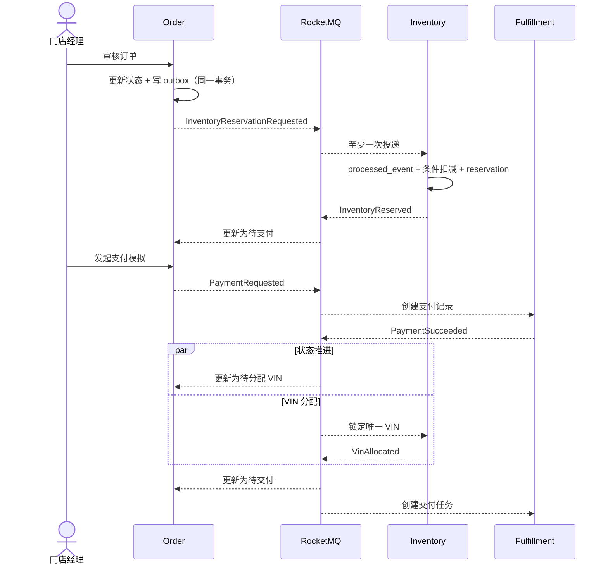

# 架构与一致性设计

## 服务边界

| 服务 | 拥有的数据 | 不负责的事情 |
|---|---|---|
| Gateway | 演示账号和 JWT 签发 | 不保存订单、不参与业务事务 |
| Order | 销售订单、渠道/客户快照、订单状态、可扩展子页面记录 | 不直接修改库存、支付或交付表 |
| Inventory | 车型配额、VIN 车辆、预占记录 | 不判断支付结果 |
| Fulfillment | 支付、退款、交付任务 | 不直接改变订单主状态 |

一个 MySQL 实例承载三个 schema，仅为了降低本地演示成本。服务禁止跨 schema 查询，因此可以在生产环境独立迁移数据库。

## 创建与履约时序



## 为什么采用 Transactional Outbox

订单状态更新与消息直接发送无法形成一个原子操作：数据库提交后发送失败会丢事件，消息先发后数据库回滚会产生幽灵事件。每个业务服务把业务修改和 `outbox_event` 写入放在同一个本地事务中，由后台任务持续发布。

发送失败时按指数退避重试。成功发送后更新 `SENT`。极端情况下可能重复发送，因此消费者仍必须幂等。

## 消费幂等

每条事件拥有全局唯一 `eventId`。消费者把 `processed_event` 插入与业务修改放在同一个本地事务中：

1. 首次插入成功，执行状态转换；
2. 重复投递触发主键冲突，直接返回成功；
3. 业务修改失败则整个事务回滚，Broker 下次重试仍可重新处理。

业务表还带有 `order_id`、`allocated_order_id`、VIN 等唯一约束，形成第二层幂等保护。

## 库存正确性

Redisson 锁键为 `inventory:{storeId}:{modelCode}`。它减少同一热点配额上的无效数据库竞争，但不是事实来源。

最终正确性由以下 SQL 保证：

```sql
UPDATE inventory_quota
SET available = available - 1,
    reserved = reserved + 1,
    version = version + 1
WHERE store_id = ?
  AND model_code = ?
  AND available > 0;
```

只有受影响行数为 1 才算成功。即使 Redis 故障、锁租约过期或两个实例同时进入，`available` 也不会小于零。数据库提交后才释放分布式锁，代码使用 `TransactionTemplate` 明确保证这一顺序。

## 取消与补偿

- 未支付：释放库存后进入 `CANCELLED`；
- 已支付：并行触发库存释放和退款；
- 支付处理中取消：先进入 `CANCELLING`；若迟到的成功事件到达，立即转为 `REFUNDING` 并补发退款请求；
- 两个事件可乱序、重复或延迟；
- Order 使用条件更新，只有 `inventory_status=RELEASED` 且 `payment_status=REFUNDED` 才结束取消；
- 已交付订单不允许普通取消。

## 缓存

订单详情采用 cache-aside，缓存键同时包含门店范围与订单 ID，TTL 在 9～11 分钟随机抖动。任何状态变化后主动淘汰订单缓存；空值不缓存，避免伪造权限范围或长期隐藏新数据。库存扣减结果永远不以 Redis 为唯一依据，避免缓存丢失造成库存恢复或超卖。

## 访问控制

- Gateway 将 JWT `role` 映射为 Spring Security authority，并按 HTTP 方法和路由执行 RBAC；
- 销售与门店经理只能访问 JWT 所属门店，门店约束在服务端再次校验；
- 支付、退款、交付任务创建属于消息驱动内部能力，不对普通业务账号开放；
- 死信查看/重放仅限管理员，成功重放记录操作者；
- 三个业务服务不映射宿主机端口，外部请求只能经 Gateway 注入可信用户上下文。

## 可观测性

所有服务暴露 `/actuator/prometheus`。Prometheus 每 10 秒采集，Grafana 自动配置 AutoFlow Overview 仪表盘，展示服务可用性、HTTP 请求率/P95、Transactional Outbox 积压与待处理死信；Prometheus 同时配置服务宕机、outbox 积压和死信告警规则。正式压测前仍需记录固定硬件与数据规模，不能脱离环境宣称固定吞吐量。
